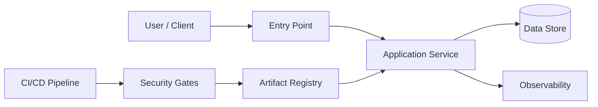

# Project Name

> One sentence explaining the engineering problem, the solution, and the primary user or system it serves.


## Executive Overview

Explain the problem, why it matters, and the outcome this project delivers. Keep this section understandable to a technical recruiter while giving an engineer enough context to continue reading.

### Key capabilities

- Capability tied to a concrete user or operational need
- Security or reliability property the system enforces
- Automation that removes a manual or error-prone step
- Evidence of validation: tests, scans, logs, screenshots, or deployment output

## Architecture

Describe the major components, trust boundaries, and data flow.



### Design decisions

| Decision | Rationale | Trade-off |
|---|---|---|
| Example: containerized deployment | Reproducible runtime and portable delivery | Requires image lifecycle management |
| Example: least-privilege IAM | Limits blast radius | Adds policy maintenance overhead |

## Threat Model & Security Considerations

### Assets

- Sensitive data, credentials, artifacts, and infrastructure requiring protection

### Trust boundaries

- External users to application edge
- Application to data store
- CI runner to registry or cloud account

### Threats and controls

| Threat | Risk | Control | Validation |
|---|---|---|---|
| Unauthorized access | Data or service exposure | Authentication, authorization, least privilege | Access-control tests |
| Vulnerable dependency or image | Supply-chain compromise | Dependency review and Trivy scanning | CI scan report |
| Secret exposure | Credential compromise | Secret store, masked logs, pre-commit scanning | Repository and pipeline checks |
| Misconfiguration | Public exposure or privilege escalation | Infrastructure review and policy checks | Configuration validation |

Document accepted risks and limitations. Never claim the system is “secure” without describing scope and evidence.

## Technology Stack

| Layer | Technology | Purpose |
|---|---|---|
| Application | [Technology] | [Purpose] |
| Infrastructure | [Technology] | [Purpose] |
| Security | [Technology] | [Purpose] |
| Observability | [Technology] | [Purpose] |
| Delivery | [Technology] | [Purpose] |

## Repository Structure

```text
.
├── src/                 # Application or automation source
├── tests/               # Unit, integration, and security tests
├── infrastructure/      # IaC, deployment, and environment definitions
├── docs/                # Architecture, threat model, and decisions
├── .github/workflows/   # CI/CD automation
├── .env.example         # Documented configuration without secrets
├── LICENSE
└── README.md
```

## Prerequisites

- Runtime and version
- Required CLI tools
- Cloud or local dependencies
- Least-privilege credentials and configuration

## Setup

```bash
git clone https://github.com/USERNAME/REPOSITORY.git
cd REPOSITORY
cp .env.example .env
# Install dependencies
# Run validation
```

List every required environment variable in `.env.example`. Never commit secrets, tokens, private keys, or real production data.

## Usage

Show the shortest successful path first, then advanced options.

```bash
# Start or run the project
# Execute a representative workflow
# Stop and clean up local resources
```

Include expected output or a screenshot so reviewers can verify success.

## CI/CD & Quality Gates

The pipeline should run on pull requests and protected branches:

1. Format and lint
2. Unit and integration tests
3. Dependency and secret scanning
4. Container or filesystem scan with Trivy
5. Build immutable artifact
6. Publish only from an approved branch or release
7. Deploy with environment protection where applicable

Document branch protection, required checks, artifact provenance, and rollback behavior.

## Testing & Validation

| Check | Command / workflow | Evidence |
|---|---|---|
| Unit tests | `[command]` | Test summary |
| Integration tests | `[command]` | Test report |
| Security scan | `trivy ...` | Scan result |
| Infrastructure validation | `[command]` | Plan or validation output |

## Observability & Operations

Describe logs, metrics, alerts, health checks, dashboards, failure modes, backup/recovery, and rollback. State what an operator should inspect first during an incident.

## Roadmap

- [ ] Next meaningful engineering improvement
- [ ] Security or reliability enhancement
- [ ] Documentation or validation milestone

## Contributing

Explain issue selection, branch naming, testing expectations, review requirements, and responsible disclosure. Use a `SECURITY.md` file for vulnerability reports.

## License

State the selected license and why it fits. Example: MIT for reusable demonstration code; Apache-2.0 when an explicit patent grant is valuable. Avoid adding a license to coursework, employer-owned material, third-party data, or security research you do not have permission to redistribute.

## Acknowledgements

Credit datasets, tutorials, upstream projects, and collaborators. Clearly distinguish original work from adapted material.
